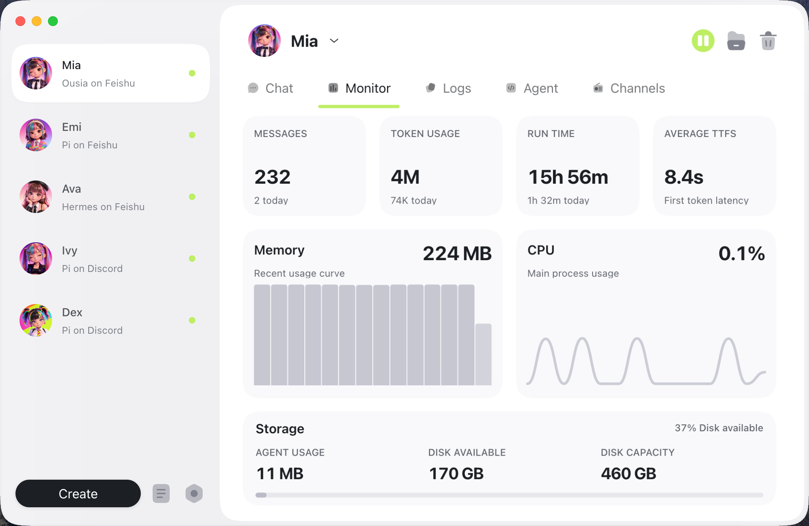
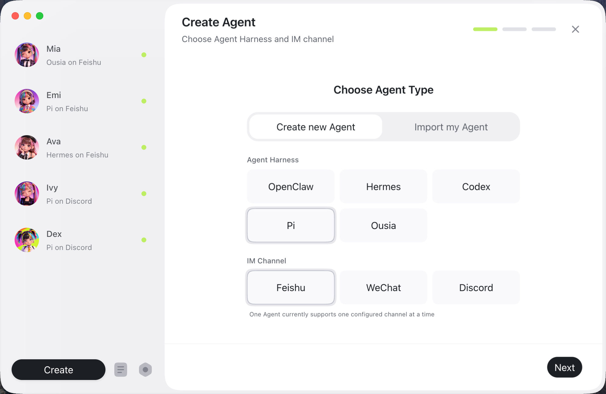
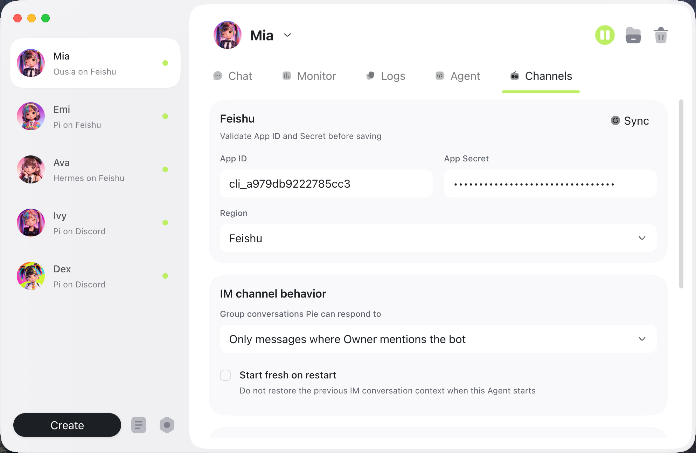
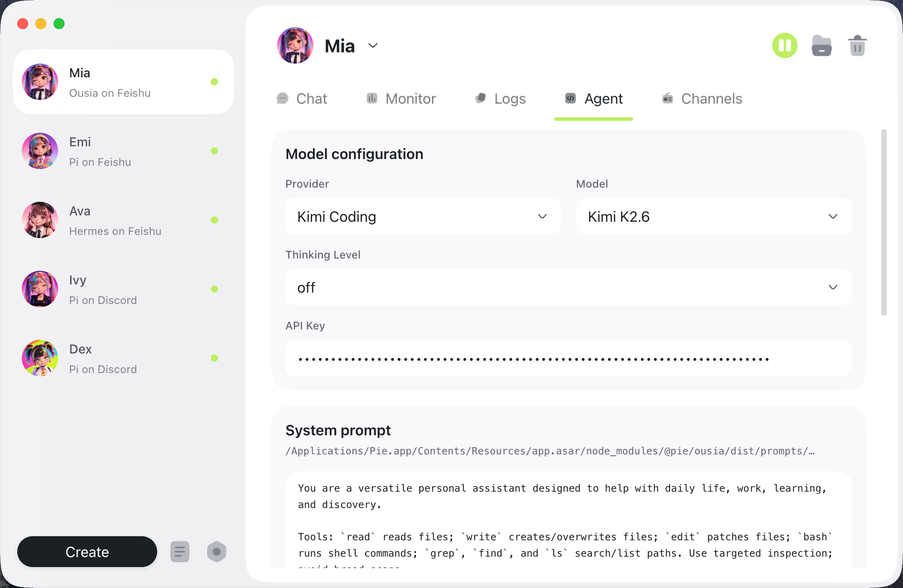
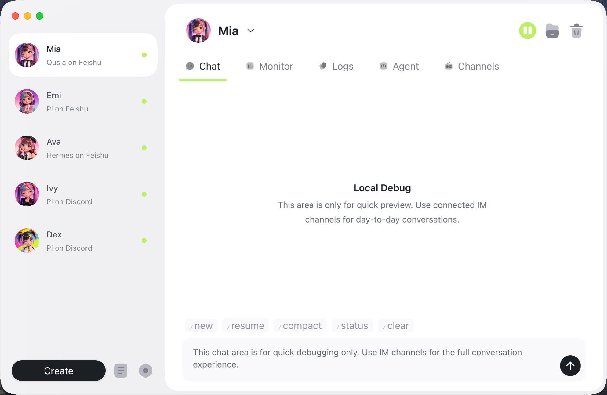
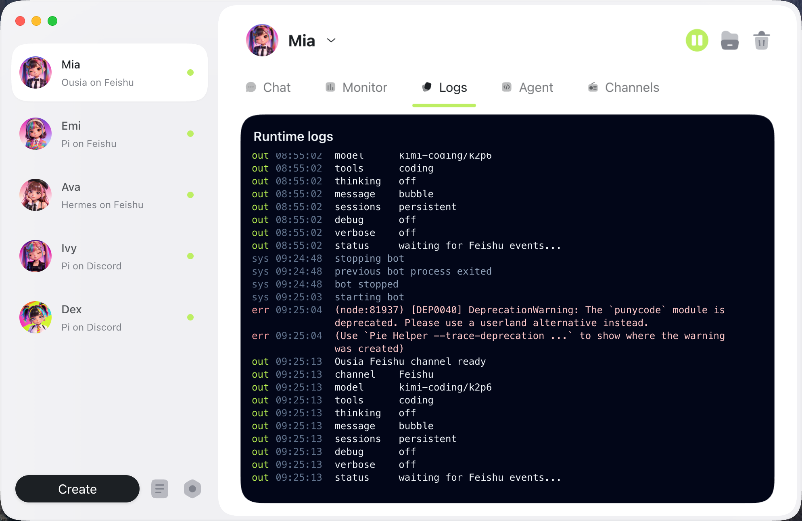
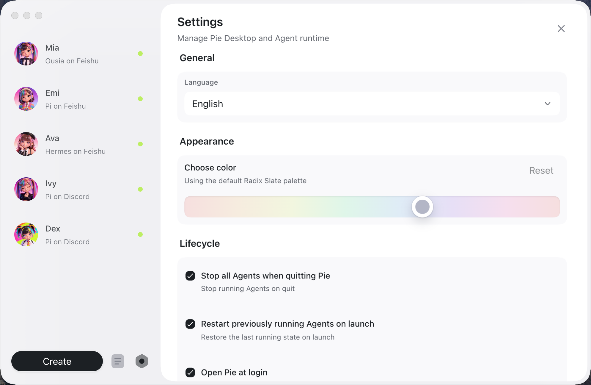

# Pie

[简体中文](README.zh-CN.md)


Pie is a desktop-first Agent client for creating, running, and observing local Agents that work through IM channels. Learn more at [pieim.com](https://pieim.com/).

The stable path today is Pie Desktop with the Pi Agent Harness and the Feishu/Lark channel. WeChat and DingTalk are early support, Discord is available in the desktop app, Slack and Telegram remain hidden development channels, and Ousia, Codex, Hermes, and OpenClaw are advanced harness choices rather than the default stable path.

<a href="docs/assets/pie-latest-intro.mp4">
  
</a>

## What Pie Does

Pie gives you one desktop surface for day-to-day Agent work:

1. Create an Agent profile, choose an Agent Harness, connect an IM channel, select a model, and start running.
2. See which Agents exist, which channels they are connected to, whether they are running, what model they use, and how much they have been used.
3. Inspect recent runtime output, profile folders, logs, config, secrets, Skills, and working directories without hunting through terminal sessions.

## Key Features

### Monitor Agent Activity

Follow messages, runtime state, CPU, memory, and recent activity from the desktop view.



### Create Local Agent Profiles

Create a profile by choosing the agent harness and IM channel that should back one agent instance.



### Configure IM Channels

Configure channel credentials and behavior from the desktop app.



### Tune Agent Runtime

Choose provider, model, thinking level, API key, system prompt, and working-directory settings for each profile.



### Quick Local Debugging

Use the local chat view for quick checks while keeping day-to-day conversations in connected IM channels.



### Inspect Runtime Output

Review logs and terminal output when an Agent is running for a long time.



### Manage Desktop Settings

Adjust desktop language, appearance, lifecycle, and launch behavior.



## Status

Pie is pre-release software. The main development target is the desktop app.

The default and most complete path today is:

```text
Desktop app -> Pi Agent Harness -> Feishu/Lark channel
```

Current channel status:

1. Feishu/Lark is the primary and most complete IM channel.
2. WeChat can log in, poll, receive, and send messages, but should still be treated as early support.
3. Discord is available in the desktop creation flow and runtime.
4. DingTalk is available in the desktop creation flow and runtime with app bot Stream mode text replies.
5. Slack and Telegram remain hidden development channels.

Current harness status:

1. Pi is the default stable harness for new Agents.
2. Ousia is an explicit advanced harness that reuses Pi session capabilities and adds its own framework companion features.
3. Codex, Hermes, and OpenClaw are real local runtime adapters with desktop diagnostics and setup surfaces, but they are not the default stable path yet.

Ousia's Task Engine is prototype-level. It is useful for exploring scheduled or longer-running Agent work, but should not be used for critical automation.

Pie does not provide a security sandbox yet. The Runtime Environment sets an Agent's home directory, working directory, and lifecycle state; file, command, and network access are still controlled by the selected Agent Harness and underlying tools.

## Download

The latest tagged pre-release build is [Pie 0.2.2](https://github.com/s1dashu/pie/releases/tag/v0.2.2). The current source version is 0.2.4.

- [Download for macOS Apple Silicon](https://github.com/s1dashu/pie/releases/download/v0.2.2/Pie-0.2.2-arm64.dmg)
- Windows and Linux builds are not published yet.

## Quick Start

Install dependencies:

```bash
npm install
```

Start the desktop app in development:

```bash
npm run desktop:dev
```

Or run CLI onboarding and start the runtime:

```bash
npm run start:onboard
npm run start
```

Build the desktop app:

```bash
npm run desktop:build
```

## Architecture

Pie is organized around a small set of boundaries:

1. **Desktop app**: manage Agents, channels, models, logs, folders, Skills, and global preferences.
2. **Runtime**: start one profile/Agent instance with its selected channels and harness capability.
3. **Agent Harnesses**: adapt Pi, Ousia, Codex, Hermes, OpenClaw, and future backends into Pie's session and event surface.
4. **Channels**: receive messages, send replies, and translate IM events for Feishu/Lark, WeChat, Discord, DingTalk, and future adapters.
5. **Profile state**: keep profile-scoped config, secrets, runtime logs, usage events, normalized agent events, Skills, and working directories under the Agent profile home.

## Development

See [Development Guide](docs/development.md) for local setup, commands, data layout, debugging, and release notes.

## License

MIT

## Notice

The Feishu/Lark messaging delivery code in `src/channels/feishu/platform/messaging/send.ts`
is adapted from `larksuite/openclaw-lark`, which is distributed under the MIT License.
