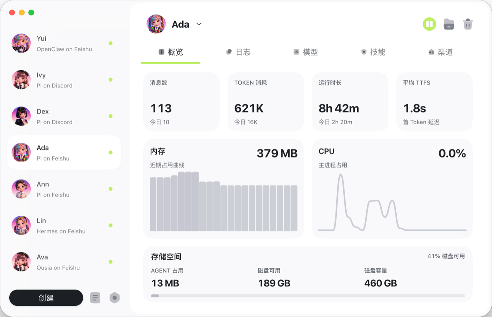
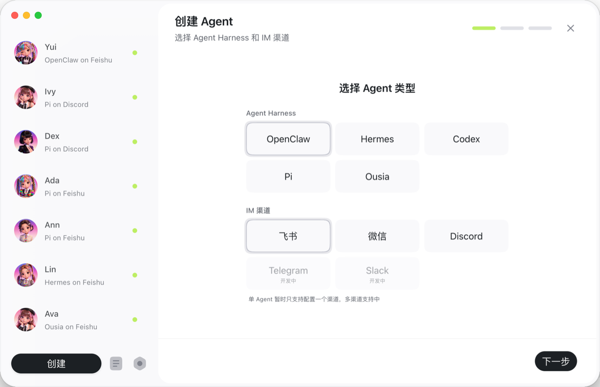
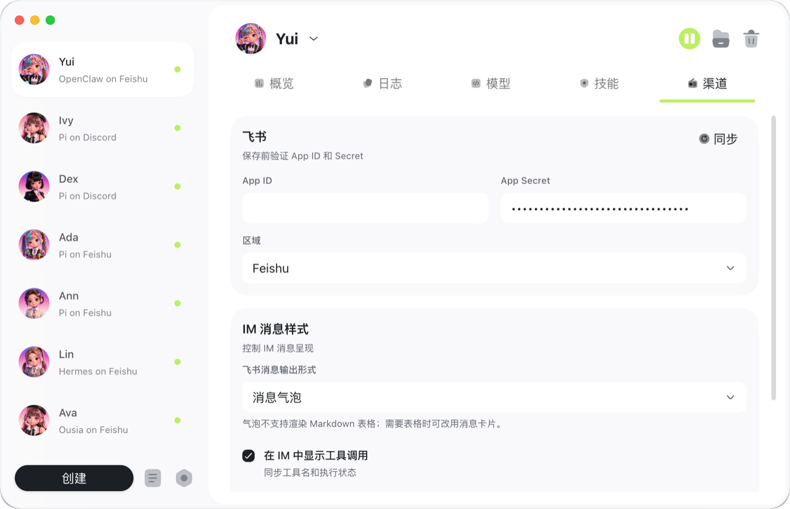
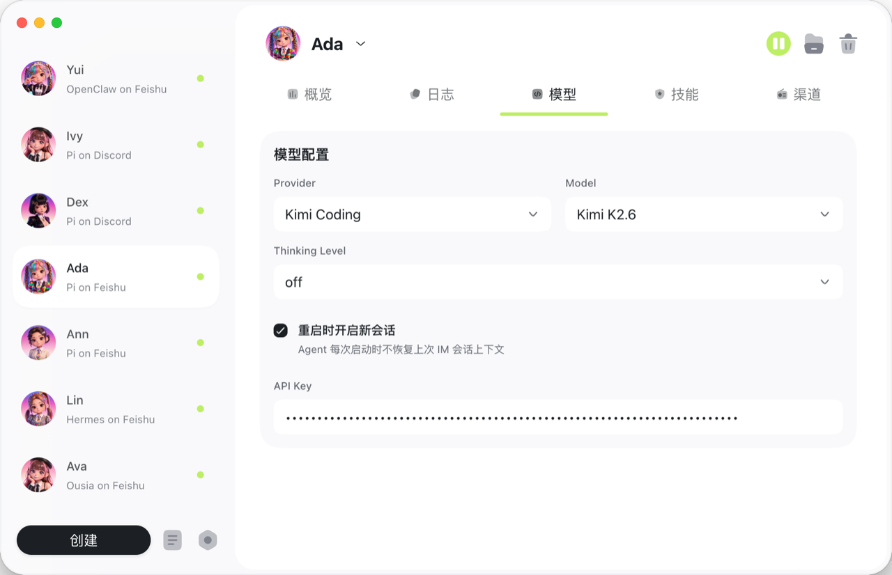
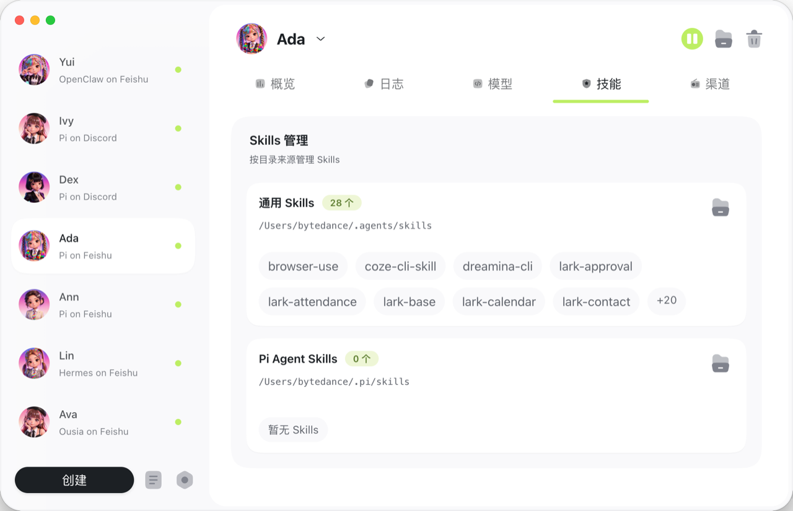
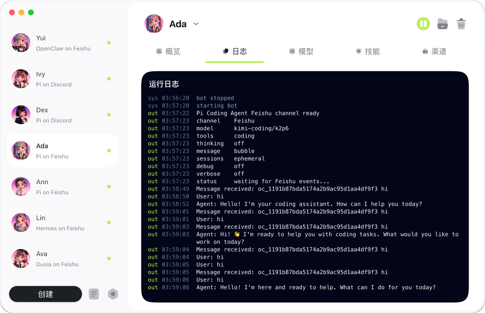
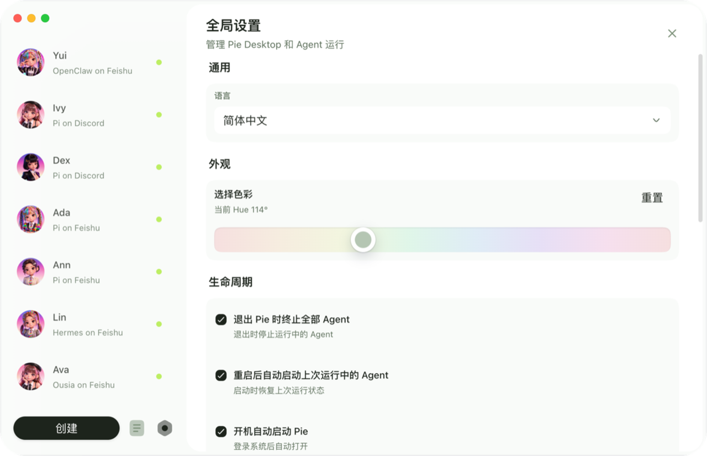
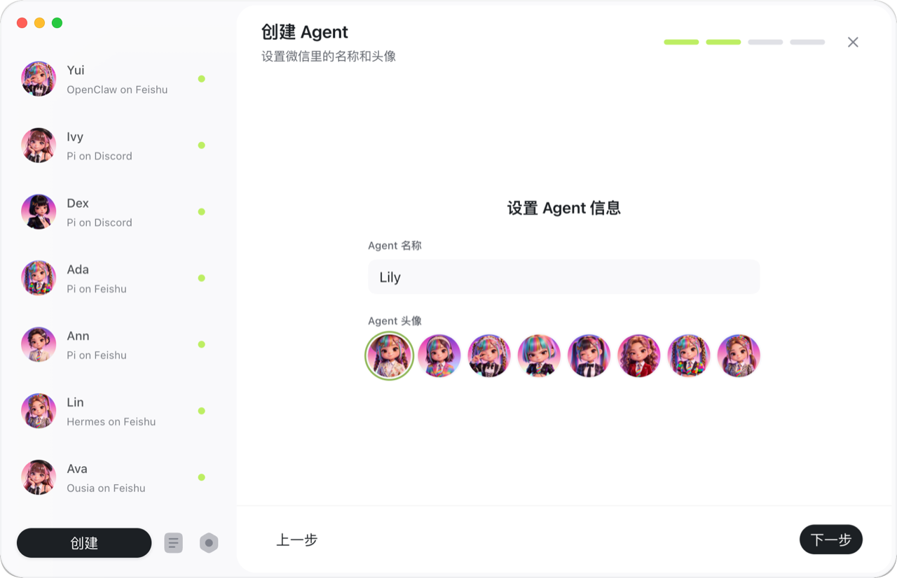

# Pie

[English](README.md)


Pie 是一个 desktop-first 的个人 Agent 客户端，用来创建、运行和观察通过 IM 渠道工作的本地 Agent。

当前最稳定的路径是 Pie Desktop + Pi Agent Harness + Feishu/Lark 渠道。WeChat 属于早期支持，Discord 已在桌面端创建流程和 runtime 中开放，Slack 和 Telegram 仍是隐藏的开发中渠道；Ousia、Codex、Hermes、OpenClaw 是高级 harness 选择，不是默认稳定路径。

<a href="docs/assets/pie-intro-video.mp4">
  
</a>

## Pie 能做什么

Pie 给日常 Agent 工作提供一个统一的桌面入口：

1. 创建 Agent profile，选择 Agent Harness，连接 IM 渠道，选择模型并启动运行。
2. 查看已有 Agent、已连接渠道、运行状态、模型配置和使用情况。
3. 在桌面端检查 runtime 输出、profile 文件夹、日志、配置、密钥、Skills 和工作目录，不必在多个终端会话里查找。

## 核心功能

### 观察 Agent 活动

在桌面视图里跟踪消息、运行状态、CPU、内存和近期活动。



### 创建本地 Agent Profile

创建 profile，选择 harness，连接渠道，并设置工作目录。



### 连接渠道和选择模型

在桌面端配置 IM 渠道和模型设置。

 

### 管理 Skills

在桌面端管理 Skill 来源。



### 检查运行输出

查看长期运行 Agent 的日志和终端输出。



### 自定义工作区

调整桌面主题和 profile 展示细节。

 

## 当前状态

Pie 仍是 pre-release 软件。当前主要开发对象是桌面端。

默认且完成度最高的路径是：

```text
Desktop app -> Pi Agent Harness -> Feishu/Lark channel
```

当前渠道状态：

1. Feishu/Lark 是主路径，也是完成度最高的 IM 渠道。
2. WeChat 可以扫码登录、轮询、收消息和发消息，但仍应视为早期支持。
3. Discord 已接入桌面创建入口和 runtime。
4. Slack 和 Telegram 仍是隐藏的开发中渠道。

当前 harness 状态：

1. Pi 是新建 Agent 的默认稳定 harness。
2. Ousia 是显式选择的高级 harness，复用 Pi session 能力，并带有自己的 framework companion 能力。
3. Codex、Hermes、OpenClaw 是真实本机 runtime adapter，桌面端已有诊断和设置入口，但还不是默认稳定路径。

Ousia Task Engine 仍是 prototype-level，适合探索 scheduled 或 longer-running Agent work，不应作为关键自动化使用。

Pie 目前不提供安全 sandbox。Runtime Environment 只设置 Agent 的 home 目录、工作目录和生命周期状态；文件、命令和网络访问仍由所选 Agent Harness 及其底层工具控制。

## 下载

最新已打 tag 的 pre-release 构建是 [Pie 0.2.2](https://github.com/s1dashu/pie/releases/tag/v0.2.2)。当前源码版本是 0.2.3。

- [下载 macOS Apple Silicon 版本](https://github.com/s1dashu/pie/releases/download/v0.2.2/Pie-0.2.2-arm64.dmg)
- Windows 和 Linux 构建暂未发布。

## 快速开始

安装依赖：

```bash
npm install
```

启动桌面端开发模式：

```bash
npm run desktop:dev
```

或者运行 CLI onboarding 并启动 runtime：

```bash
npm run start:onboard
npm run start
```

构建桌面端：

```bash
npm run desktop:build
```

## 架构

Pie 围绕几条清晰边界组织：

1. **Desktop app**：管理 Agents、channels、models、logs、folders、Skills 和全局偏好。
2. **Runtime**：启动一个 profile/Agent instance，并加载它选择的 channels 和 harness 能力。
3. **Agent Harnesses**：把 Pi、Ousia、Codex、Hermes、OpenClaw 以及未来 backend 适配到 Pie 的 session 和 event surface。
4. **Channels**：接收消息、发送回复，并为 Feishu/Lark、WeChat、Discord 和未来 adapter 翻译 IM 事件。
5. **Profile state**：把 profile-scoped config、secrets、runtime logs、usage events、normalized agent events、Skills 和工作目录保存在 Agent profile home 下。

## 开发

本地设置、命令、数据布局、调试和发布说明见 [Development Guide](docs/development.md)。

## License

MIT

## Notice

`src/channels/feishu/platform/messaging/send.ts` 中的 Feishu/Lark 消息发送代码改编自 `larksuite/openclaw-lark`，该项目使用 MIT License。
